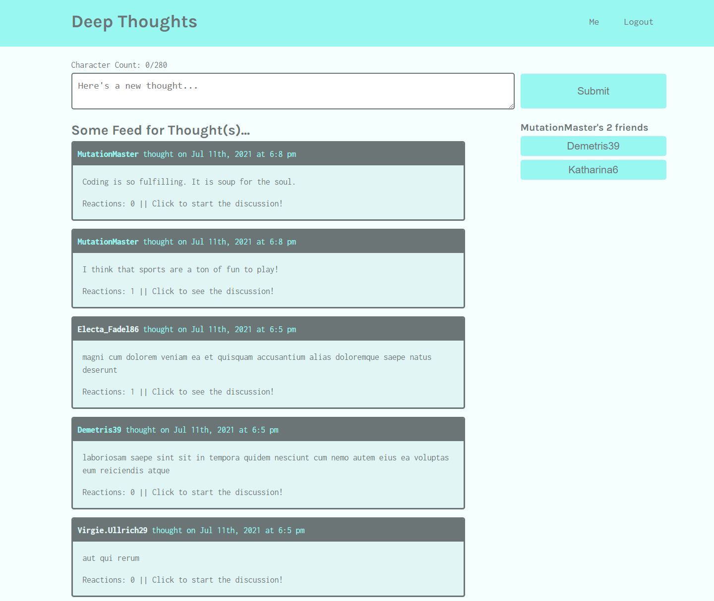

# Deep Thoughts

## Description
Deep Thoughts is a social media app that allows users to share their thoughts with other users. Users can create, read, update, and delete (CRUD) thoughts once they have logged into their account. There is added friend functionality as well as reactions to really get people thinking! This application was created with the MERN stack of technologies and GraphQL.  

## Table of Contents

* [Installation](#Installation)
* [Usage](#Usage)
* [License](#License)
* [Questions](#Questions)
* [Credits](#Credits)

## Installation
No installation required. Head to [Deep Thoughts](https://fast-plateau-23885.herokuapp.com/thought/60eaed3f340cce001516d02a) to starting sharing!

## Usage
Follow on screen prompts to view thoughts and create an account. Once logged in, you can view your dashboard and starting sharing with other thinkers!
  

## License
MIT License

## Questions
You may contact the project author via:
* Email: seanbrent5@gmail.com
* GitHub: [Brentsa](https://github.com/Brentsa)

## Credits
Sean Brent